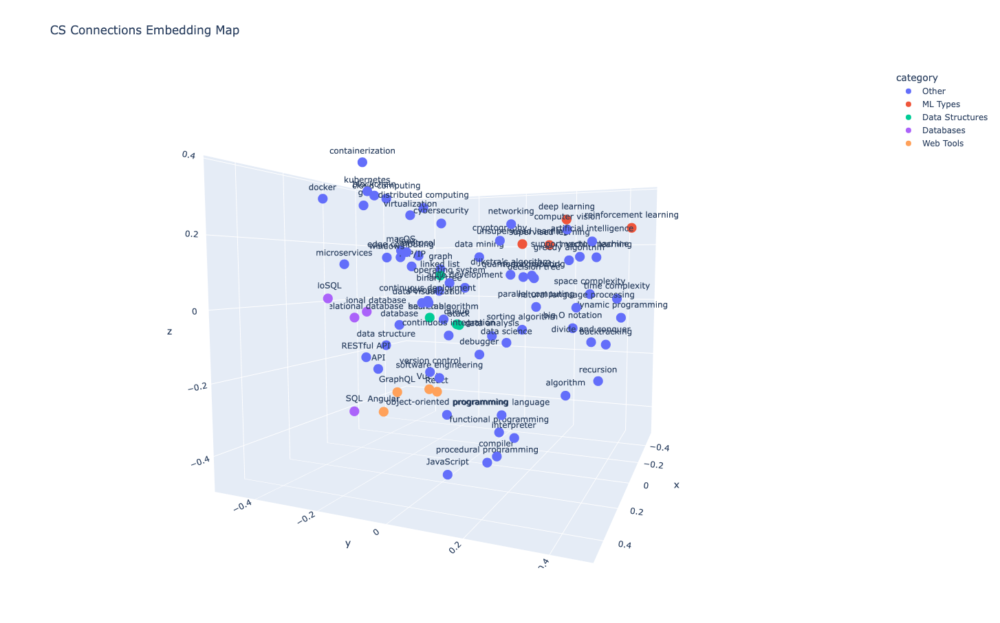

# CS Connections — Phase 1

A NYT Connections-inspired word puzzle game built around computer science terminology, powered by semantic embeddings and cosine similarity.

---

## Overview

CS Connections presents players with 16 CS terms and challenges them to group them into four categories of four. Unlike the original NYT game, category relationships are grounded in semantic similarity — terms are embedded using a pretrained sentence transformer and clustered to reveal conceptual groupings.

Phase 1 establishes the core data pipeline: term embedding, similarity scoring, clustering, puzzle assembly, and a 3D visualization of the embedding space.

---

## Features

- **Semantic embeddings** via `sentence-transformers` (`all-MiniLM-L6-v2`)
- **Cosine similarity matrix** across 80+ CS terms
- **K-Means clustering** (8 clusters) to discover natural groupings
- **Handcrafted puzzle categories** drawn from clustering insights
- **Guess validation** logic to check player selections against correct groupings
- **3D PCA visualization** of the embedding space using Plotly

---

## Tech Stack

| Tool | Purpose |
|---|---|
| `sentence-transformers` | Generating semantic embeddings |
| `scikit-learn` | Cosine similarity, K-Means, PCA |
| `pandas` / `numpy` | Data wrangling and matrix ops |
| `plotly` | Interactive 3D visualization |

---

## Project Structure

```
cs-connections/
├── main.py          # Core pipeline: embed → cluster → puzzle → visualize
└── README.md
```

---

## How It Works

### 1. Term Embedding
Each CS term is paired with a plain-English description. Those descriptions are encoded into 384-dimensional vectors using `all-MiniLM-L6-v2`.

### 2. Similarity Scoring
A cosine similarity matrix is computed across all term embeddings, producing a square DataFrame where each cell represents how semantically close two terms are.

### 3. Clustering
K-Means (k=8) groups terms by proximity in embedding space. These clusters inform which terms belong together conceptually — and which make good puzzle categories.

### 4. Puzzle Assembly
Four hand-selected categories are defined:

| Category | Terms |
|---|---|
| Data Structures | stack, queue, linked list, hash table |
| ML Types | supervised learning, unsupervised learning, reinforcement learning, deep learning |
| Web Tools | React, Angular, Vue.js, GraphQL |
| Databases | SQL, NoSQL, relational database, non-relational database |

The 16 terms are shuffled and presented as the puzzle board.

### 5. Guess Validation
`check_category()` takes a player's selected words and checks whether they exactly match any defined category, returning the category name on a correct guess.

### 6. 3D Visualization
PCA reduces the 384-dimensional embeddings to 3 components. Plotly renders an interactive scatter plot with terms colored by category membership (puzzle categories highlighted, all others labeled "Other").

---

## Setup

```bash
pip install sentence-transformers scikit-learn pandas numpy plotly
```

```bash
python main.py
```

---

## Embedding Visualization

Terms are projected from 384 dimensions down to 3 via PCA and plotted interactively with Plotly. Puzzle categories are color-coded; all other terms appear in blue.



---

## Phase 2 Goals

- Build an interactive frontend (React or Streamlit) for the actual puzzle UI
- Generate puzzle categories dynamically from clustering output rather than hardcoding them
- Add difficulty tiers based on inter-cluster similarity scores
- Expand the term bank and support multiple puzzle seeds
